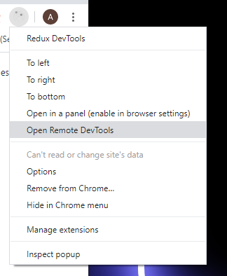
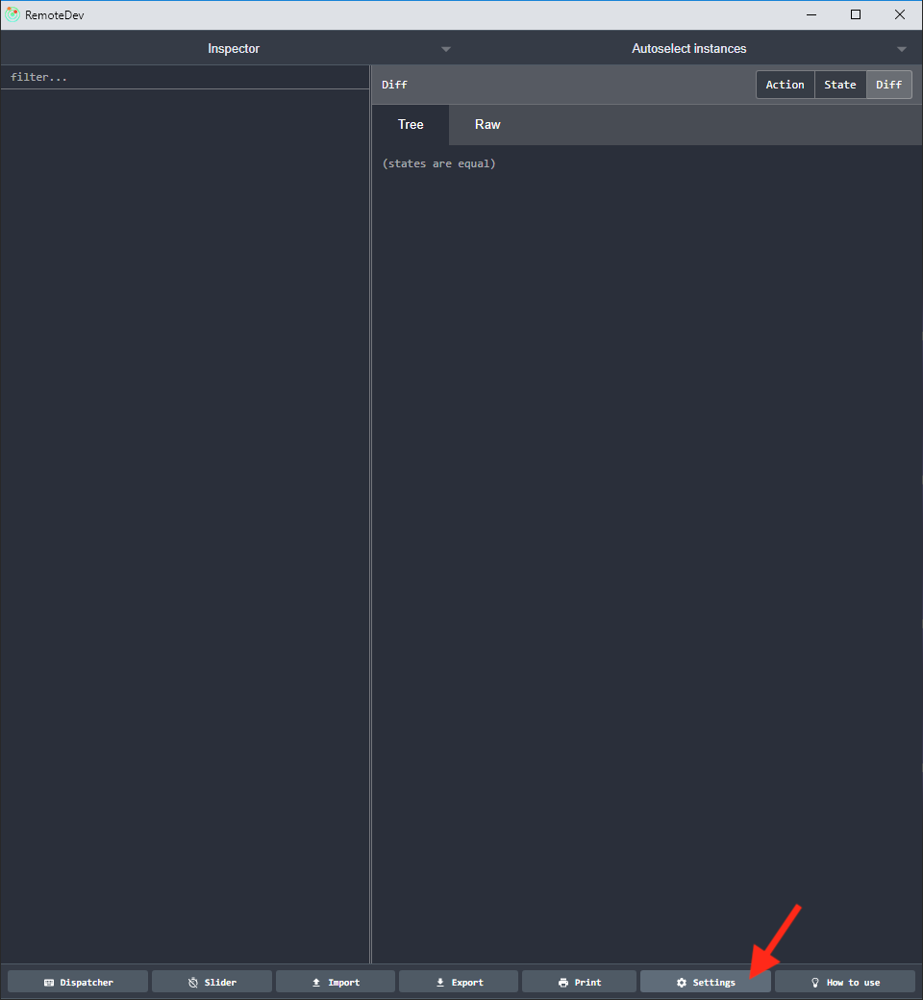
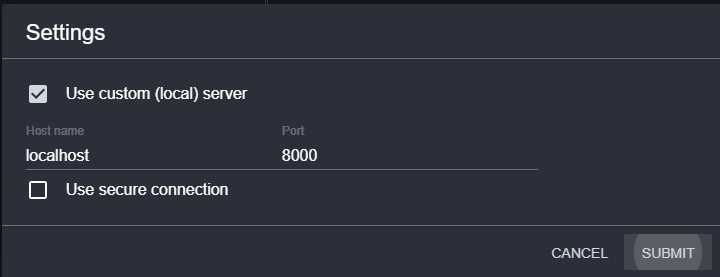
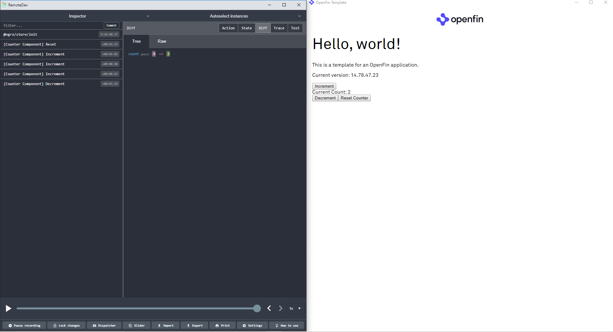

# Angular ngrx redux devtools integration

A simple Angular template. The purpose of this repository is to provide a basic example of using *ngrx* store-devtools to integrate with a client side angular application running in OpenFin. 

### How to use this:

* Clone this repo: `git clone -b angular https://github.com/adam-saland/app-template`
* Checkout angular branch: `cd app-template`
* Install the dependencies: `npm install`
* Start the remotdev server and launch the application: `npm start`
* When the application has launched:
  * Open the Chrome browser redux remote devtools extension:
  
  * Select the **settings** button on the bottom menu bar
  
  * Enter the exact configuration seen below and select submit
  
  * State changes in the example application will be registered in the remote devtools just as they would be in a chrome tab. All state changes will be reflected as seen below.
  

# License
The code in this repository is covered by the included license.

However, if you run this code, it may call on the OpenFin RVM or OpenFin Runtime, which are covered by OpenFin's Developer, Community, and Enterprise licenses. You can learn more about OpenFin licensing at the links listed below or just email us at support@openfin.co with questions.

https://openfin.co/developer-agreement/ https://openfin.co/licensing/